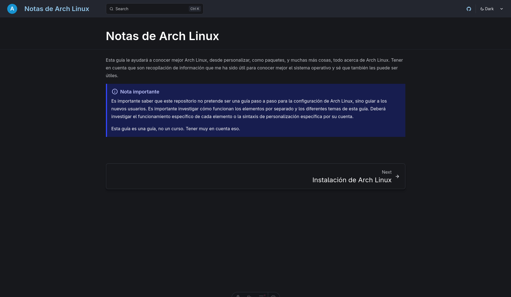

# Arch Linux Notes

[Version en Español](./README.md)



My Arch Linux notes website. This guide will help you learn more about Arch Linux, from customization and packages to much more—everything about Arch Linux. Keep in mind that this is a compilation of information that has been useful to me in getting to know the operating system better, and I know it can be useful to you as well.

---

## 🚀 Quick Start

This project is built with Astro (https://astro.build), MDX (https://mdxjs.com), and Tailwind CSS (https://tailwindcss.com).

### Requirements

- Node.js 18+
- pnpm (package manager)

---

## 📁 Project Structure

Approximately...

```txt
/
├── public/
│ └── images/ # Static images
├── src/
│ ├── content/ # MDX files (content)
│ ├── layouts/ # Astro layouts
│ ├── pages/ # Astro pages/paths
│ └── components/ # Reusable components
├── astro.config.mjs # Astro configuration
├── tailwind.config.mjs # Tailwind configuration TailwindCSS
└── package.json # Project Dependencies
```

---

## ⚠️ Important Note

It is important to keep in mind that this website is not intended to be a step-by-step guide for the complete installation or configuration of Arch Linux, but rather an orientation for new users. It is recommended that you independently research how each element works and delve deeper into the various topics covered in this guide. Each user will need to learn the specific functionality of each component and the corresponding customization syntax on their own.

Remember: this is a guide, not a complete course. Keep this in mind.

---

## 🛠️ Technologies

- [Astro](https://astro.build) - Modern web framework
- [MDX](https://mdxjs.com) - Markdown with JSX components
- [TailwindCSS](https://tailwindcss.com) - Utility-first CSS framework
- [pnpm](https://pnpm.io) - Fast and efficient package manager

---

## Information

**License:** Apache License 2.0

**Author:** Fravelz