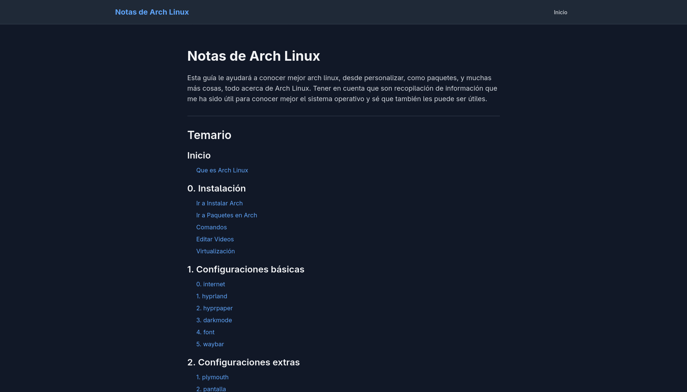

# Notas de Arch Linux



Mi web de notas de arch linux. Esta guía le ayudará a conocer mejor arch linux, desde personalizar, como paquetes, y muchas más cosas, todo acerca de Arch Linux. Tener en cuenta que son recopilación de información que me ha sido útil para conocer mejor el sistema operativo y sé que también les puede ser útiles.

---

## 🚀 Inicio rápido

Este proyecto está construido con [Astro](https://astro.build), [MDX](https://mdxjs.com), y [TailwindCSS](https://tailwindcss.com).

### Requisitos

- Node.js 18+
- pnpm (gestor de paquetes)

---

## 📁 Estructura del proyecto

```txt
/
├── public/
│   └── imagenes/          # Imágenes estáticas
├── src/
│   ├── content/           # Archivos MDX (contenido)
│   ├── layouts/           # Layouts de Astro
│   ├── pages/             # Páginas/rutas de Astro
│   └── components/        # Componentes reutilizables
├── astro.config.mjs       # Configuración de Astro
├── tailwind.config.mjs    # Configuración de TailwindCSS
└── package.json           # Dependencias del proyecto
```

---

## ⚠️ Nota importante

Es importante saber que este repositorio no pretende ser una guía paso a paso para la configuración de Arch Linux, sino guiar a los nuevos usuarios. Es importante investigar cómo funcionan los elementos por separado y los diferentes temas de esta guía. Deberá investigar el funcionamiento específico de cada elemento o la sintaxis de personalización específica por su cuenta.

Esta guía es una guía, no un curso. Tener muy en cuenta eso.

---

## 🛠️ Tecnologías

- [Astro](https://astro.build) - Framework web moderno
- [MDX](https://mdxjs.com) - Markdown con componentes JSX
- [TailwindCSS](https://tailwindcss.com) - Framework CSS utility-first
- [pnpm](https://pnpm.io) - Gestor de paquetes rápido y eficiente

---

## Información

**Licencia:** Apache Licence 2.0

**Autor:** Fravelz
